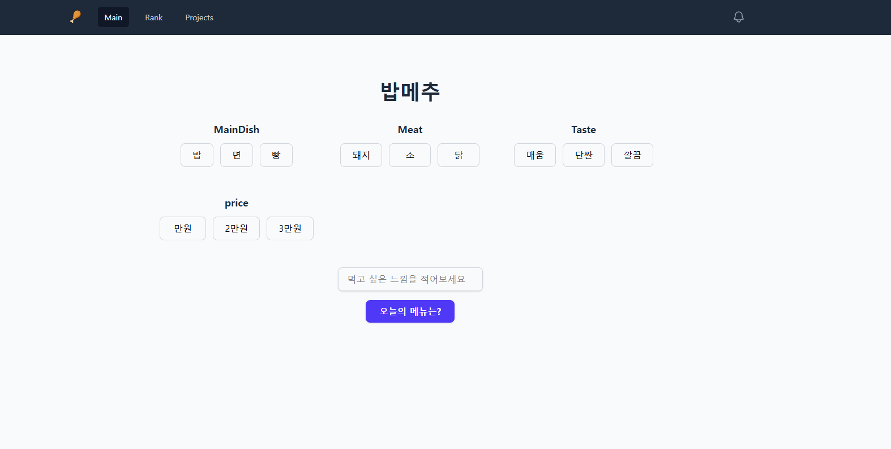

# 밥메추

## 기술 스택

- Frontend
  - Next.js (App Router)
  - React + TypeScript
  - Tailwind CSS (UI 스타일링)

- Backend
  - Next.js API Route / Server Actions
  - Supabase (PostgreSQL)
    - 메뉴 테이블
    - 검색/선택 로그 테이블
    - 인기 메뉴 집계 테이블

- 외부 API
  - 네이버 지도 API
    - 현재 위치 기반 주변 식당 검색
    - 지도/마커 표시

## 개요
밥메추는 "오늘 뭐 먹지?"를 고민하는 사람들을 위해
메뉴 추천과 주변 식당 탐색을 한 번에 제공하는 서비스입니다.

사용자는 음식 취향이나 현재 기분만 간단히 선택하면,
밥메추가 어울리는 메뉴를 추천하고
내 위치 근처에서 해당 메뉴를 파는 식당을 함께 보여줍니다.

## 문제 정의
- 사람들은 매일 "오늘 뭐 먹지?"를 고민하지만,
  막상 메뉴를 고르려고 하면 쉽게 떠오르지 않습니다.
- 한 사람 안에서도
  - 매운 음식 / 안 매운 음식
  - 한식 / 중식 / 양식 / 분식
  - 간단한 식사 / 든든한 식사
  등 상황에 따라 취향이 계속 바뀐다.
- 메뉴를 겨우 골라도,
  "이 근처에 이거 파는 곳이 있나?"를 다시 검색해야 두번 일하게 됩니다.
- 지도 앱, 배달 앱, 블로그 후기를 왔다 갔다 하다 보면
  오히려 결정 피로(decision fatigue)가 커진다.

## 핵심 기능

1. 메뉴 추천
   - 취향/상황 간단 선택 → 메뉴 카드 추천
   - 다시 뽑기(Shuffle) 기능

2. 인기 메뉴 랭킹
   - 최근 일주일동안 가장 많이 고른 메뉴 Top10

3. 주변 식당 검색
   - 추천 메뉴 클릭 시, 주변 식당 리스트 + 지도 표시
   - 거리순 / 평점순 / 가격대 필터
   - 식당 상세: 이름, 위치, 메뉴 대표 사진/태그 링크

4. 검색 기록 기반 개인화
   - 내가 자주 고른 메뉴/카테고리 분석
   - "너가 자주 먹는 메뉴" 섹션 제공

5. 간단 공유 기능
   - 추천 결과를 링크/이미지로 공유해서
     - "오늘 밥메추가 이거 뽑아줬다"를 친구/팀원에게 보내기
